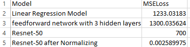

# Quadratic Equation 
## Introduction
I will be using a quadratic image dataset for this notebook. The dataset can be found on [Kaggle](https://medium.com/r/?url=https%3A%2F%2Fwww.kaggle.com%2Farchanghosh%2Fimages-of-randomly-generated-quadratic-equations) courtesy of [Archanghosh](https://medium.com/u/b238bb551c95). The dataset consists of two CSV files and one image folder. The CSV files contain information about the images such as the IDs, the values of each coefficient, and the equation's roots. The coefficients are arranged in random order.

## The Problem
Our task is to find the coefficients of each equation. To speed up the training time we'll be using a pre-trained neural network Resnet-50. Since this is a regression problem I will be altering the model to better suit our data.

## The Process
I started by building a Simple linear Regression Model as a Baseline and obtained very poor results from it. I then made a simple feedforward network with three hidden layers but that didn't improve the model that much. Finally I tried using a resnet-50 pretrained neural network and adjusted the final output to use linear regression. This model performed comparitively better than the previous ones but the loss was still quite high. I used Normalized the data data and that gave me the best result.

## Endnote
This project is a part of my series 25 projects challenge. If you want to see more of these or want to take part yourself, please visit the [introduction page](https://medium.com/r/?url=https%3A%2F%2Fkeeganfdes03.medium.com%2Ff2150afe053%3Fsource%3Dfriends_link%26sk%3D5ae10ad6072aa80c0f1ed3865a0196a8).
 
